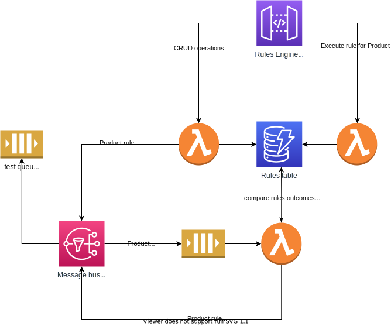

# rules engine

Product rules engine

## Environment setup

```bash
yarn local:up
```



```bash
# tear down localstack docker container
yarn local:down
```

## Testing

```bash
yarn dev

yarn test
```
